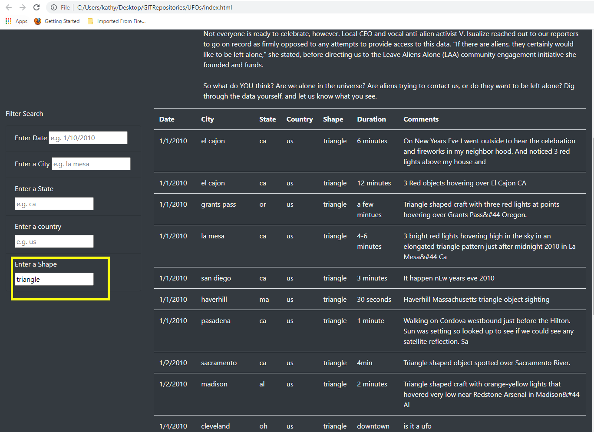
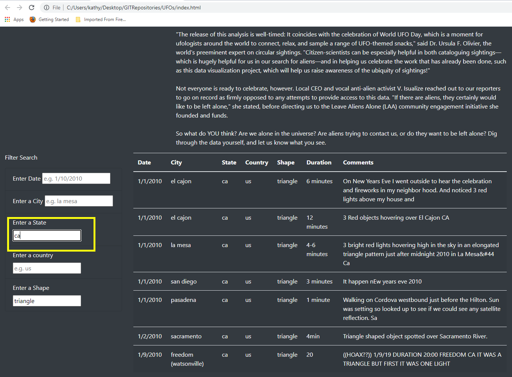

# UFOs

## Overview of Project

This webpage allows users to analyze UFO sighting data, including date, city, state, country, shape of object, duration of sighting and additional descriptions. Additionally, the user can fine-tune their analysis by filtering on date, city, state, country and shape.

## Results

### How to Use the Application

The webpage is reached at file:///C:/Users/kathy/Desktop/GITRepositories/UFOs/index.html and opens to display the enire database of UFO sightings. The data may be filtered on various fields (date, city, state, country and shape) to create different views for analysis.

Homepage:

The filtering tool is on the left hand side of the page. To change the data display, enter the appropriate values. After entering a value in a field press enter, tab or click on another field, and the table will refresh as defined by the new filter.

### Filtering on One Field

Example: Filter on City

Enter a city name using all lower case. Scroll through the homepage to see the available cities.

### Filtering on Multiple Fields

Enter the value for the first field. Enter "triangle" in the Shape field. The table is refreshed to display only the sightings of triangle shapes.

Enter 'ca' in the State field and the table is refreshed applying the additional filter of sightings in California. 

### Remove a filter

To delete a fielter, delete the value in the field. To remove all filters at once, refresh the page.

## Summary

### Limitations of Design

This webpage is a great start in making UFO data available to ufologists, but the search design has some drawbacks. Significantly, only one value may be used in each search field, necessitating multiple queries to filter, for example, on a range of dates. Additionally, the user must know the values of the search fields in order to use them in a filter.

### Recommendations

Upgrade the search capability to allow user to choose search values from a list of available values. For example, the State field could be a dropdown menu of all states in the database. Additionally, allow the user to select multiple values in a field.

Upgrade the table capabilities to allow the user to sort the results on a chosen field. For example, clicking on the State header name would sort the table by state.